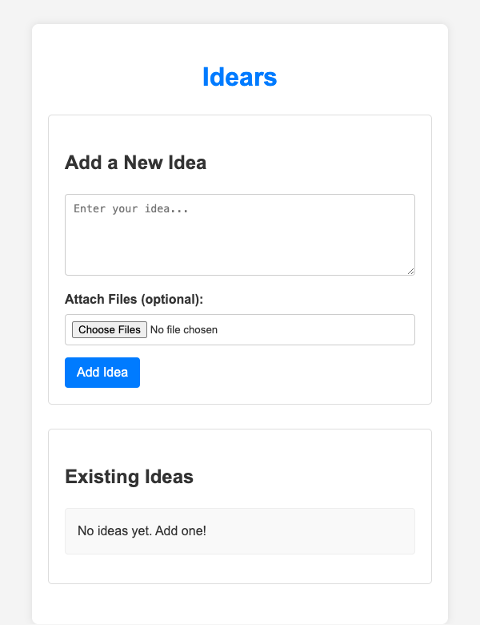
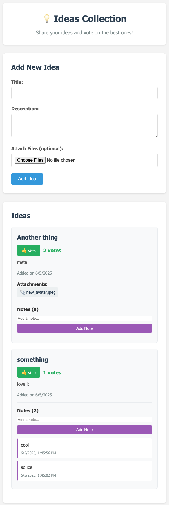
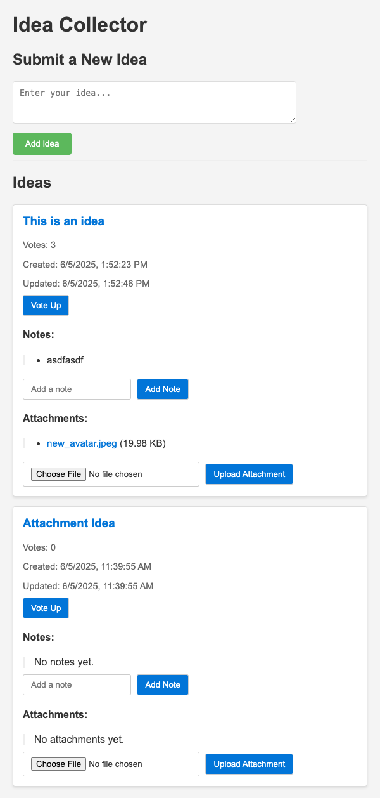

# Screenshots Gallery

Visual showcase of all 15 coding agent implementations from the June 2025 evaluation.

> **📖 Back to:** [Main Report](README.md) | [Full Turing Post Article](https://www.turingpost.com/p/codingreport)

---

## IDE Agents

### Copilot
**Score: 13/25** | Traditional autocomplete, requires expertise

### Cursor
**Score: 21/25** | Professional favorite, great developer experience

### RooCode
**Score: 20/25** | Expert-level, excellent BYOM support

### Windsurf
**Score: 13/25** | Basic functionality, needs improvement

---

## CLI Agents

### Aider
**Score: 17/25** | First OSS agent, git-heavy workflow

### Claude Code
**Score: 19/25** | Solid output, blinking lights UI

### Codex CLI
**Score: 19/25** | Functional but unremarkable

### Goose
**Score: 16/25** | Configuration-heavy, expert-focused
*No screenshot available - CLI-based interface*

---

## Full-Stack Agents

### Codex Agent
**Score: 18/25** | GitHub integration, PM-friendly

### Copilot Agent
**Score: 21/25** | Game-changing potential if it works
*No screenshot available - GitHub-hosted implementation*

### Cursor Agent (Background)
**Score: 24/25** | 🏆 **TOP PERFORMER** - Surprising background capabilities

### Jules
**Score: 21/25** | Slick Google product, fast execution

### Replit
**Score: 15/25** | Best for business value, integrated platform
*Screenshot not available - Live on Replit platform*

---

## Hybrid Platforms

### v0
**Score: 24/25** | 🏆 **TOP PERFORMER** - Obviously the way to go for UI design
*Screenshot not available - NextJS/Vercel deployment*

### Warp
**Score: 24/25** | 🏆 **TOP PERFORMER** - Terminal replacement, scripting powerhouse

---

## Analysis Notes

### Screenshot Patterns
- **Most Complete**: Cursor Agent, Warp, and Jules delivered polished, professional-looking applications
- **Simplest UIs**: Aider, Codex CLI, and Windsurf produced more basic interfaces
- **Missing Screenshots**: Some agents (Goose, Copilot Agent, Replit, v0) were deployed on external platforms or had CLI-only interfaces

### Visual Quality Insights
- **Professional Polish**: Top-scoring agents (24/25) consistently produced clean, modern interfaces
- **Feature Completeness**: Screenshots show varying levels of feature implementation - from basic CRUD to full voting/commenting systems
- **UI Consistency**: Most agents chose similar tech stacks (React/Express), leading to comparable visual outputs

### Notable Observations
- Cursor Agent produced the most sophisticated UI with advanced features
- Warp created a clean, functional interface despite being primarily a terminal tool
- Basic agents focused on core functionality over visual polish
- Platform-specific agents (Replit, v0) leverage their hosting environments' strengths

---

**📊 Want the detailed analysis?** Check out the [full evaluation report](README.md) with scoring breakdowns, methodology, and recommendations.

**🔗 Explore the code:** Each screenshot links to its corresponding GitHub repository with full source code.

